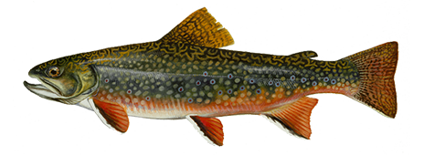

# Seasonal climate and stream salmonids

Repository for data and scripts accompanying:

[Maitland, BM](https://bryan-m-maitland.netlify.app/) & [Latka, AL](https://dnr.wisconsin.gov/topic/Fishing/people/centraloffice.html). Shifting climate conditions affect recruitment in Midwestern stream trout, but depend on seasonal and spatial context. **Currently under second review at *Ecosphere*.**

### Abstract 
Climate change is a complex threat to freshwater ecosystems. Effects on aquatic species will likely differ among populations depending on seasonal and spatial context, which makes a detailed understanding of population responses to shifting climate conditions key to guiding strategic decision making. However, few empirical studies have tested for such context-dependency on distinct populations across seasons or at large spatial scales. We used 26 years of standardized survey data on recreationally and economically important brook trout (Salvelinus fontinalis) and brown trout (Salmo trutta) in Wisconsin, USA to assess short- and long-term variability in population trends, and quantify the influence of seasonal and spatial climate variability (air temperatures and precipitation) on annual recruitment strength (as indexed by young-of-year [YOY] relative abundance in summer). Some short-term population fluctuations were spatially consistent across the state, indicative of broad-scale environmental forcing. Over the longer-term, average YOY and age-1 and older brook trout relative abundance has declined since 2006, especially for YOY, while brown trout abundance has substantially increased. Effects of climate conditions on recruitment varied by species, season, and latitude. Increasing maximum summer temperatures were associated with lower brook trout recruitment, but higher brown trout recruitment. The effect for both species was stronger at lower latitudes. Spring temperatures were positively related to brown trout recruitment at lower latitudes; in mid-latitude and northern streams, they were related to increasing recruitment up to about 1 standard deviation, above which recruitment declined.  High and low winter and spring precipitation were associated with precipitous declines in recruitment for both species. In contrast, summer precipitation was positively related to recruitment in northern streams for brook trout and southern streams for brown trout. Our results demonstrate that shifts in climate can affect recruitment in similar species differently depending on temporal (seasonal) and spatial (warm, southern regions compared to cool, northern regions) context. Given trout population trends in Wisconsin and climate projections for the Midwestern USA, location- and species-specific management actions are needed that account for this context dependency. Management should aim to maximize resiliency of populations to extreme climate conditions by buffering negative influences on recruitment.

